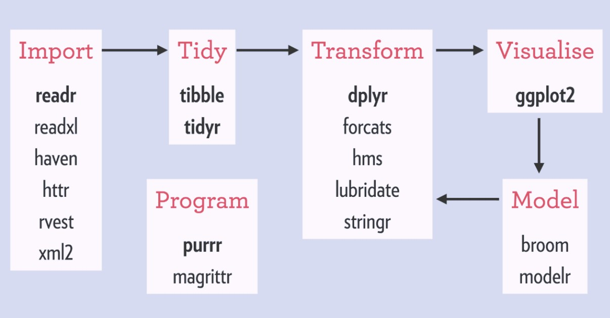

--- 
title: "Workshop: Tidyverse"
author: "María Reyes Retana"
date: "`r Sys.Date()`"
site: bookdown::bookdown_site
---

# Workshop: Introducción a tidyverse

**SCL Data - Data Ecosystem Working Group**

[](https://scldata.iadb.org)

Este es un taller básico para el uso de R y tidyverse para el análisis de datos. 
El contenido del taller será el siguiente:

- **1. Preliminares**
  - Cheatsheets
  - Cargar paquetes
  - Importar data 
  - Exploración básica
 
- **2. Reshape your data**
  - Pivot_longer, pivot_wider
  - Append, left_join
 
- **3. Limpieza y modificación**
  - Filter, select
  - Mutate
  - Group_by, summarize
 
- **4. Visualization with tidy data/ ggplot**

Para la elaboración de este curso utilice estos cursos de github: 

- [Análisis de datos](https://github.com/tereom/r-analisis-datos)

- [Tidyverse](https://github.com/nuitrcs/r-tidyverse)
 
 
## Primeros pasos
 
Antes de que inicie el workshop deberás tener instalado [R](https://cran.r-project.org) y [R studio](https://www.rstudio.com/products/rstudio/download/) 
en tu computadora. 
 
Si tienes computadora del banco debes de solicitarlo a ITE.
Adicionalmente deberás instalar o actualizar el paquete tidyverse. <br> `install.packages(c("tidyverse"))` <br> 
 
## Porqué Tidyverse? 
 
Una de las grandes ventajas de R es que tiene una gran comunidad activa. Esto ha generado que exista una gran cantidad de paquetes que están disponibles para nosotros para el análisis de datos. 
Desde RStudio podemos intalar estos *paquetes* `install.packages("nombre_paquete")` y así aprovechar el talento de otros para hacer nuestro trabajo más sencillo.

En particular, Tidyverse es un conjunto de paquetes que fue creado para la manipulación, exploración y visualización de datos. Estos paquetes comparten un diseño común y tienen el objetivo de hacer más fácil el flujo de trabajo en el análisis de datos. La siguiente imagen muestra qué paquetes del Tidyverse se utilizan en las distintas etapas del análisis de datos.

```{r, out.width = "700px", include=T, echo=F}



```

Pueden leer aquí el artículo completo de [What is the tidyverse?](https://rviews.rstudio.com/2017/06/08/what-is-the-tidyverse/)
 
 
## Recursos adicionales

Hay múltiples recursos para aprender R de forma gratuira, aquí les dejo unos de los que me han ayudado.

- [Cheatsheets](https://www.rstudio.com/resources/cheatsheets/)
- [Data-to-viz.com](https://www.data-to-viz.com)
- [R Graph Gallery](https://www.r-graph-gallery.com)
- [R Programming for Data Science: Peng](https://leanpub.com/rprogramming)